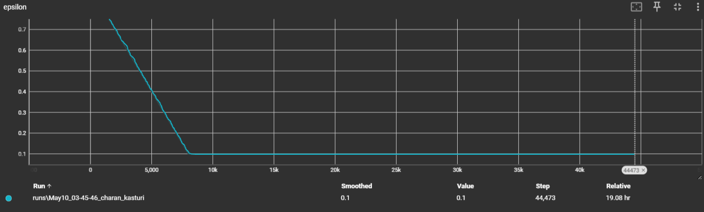
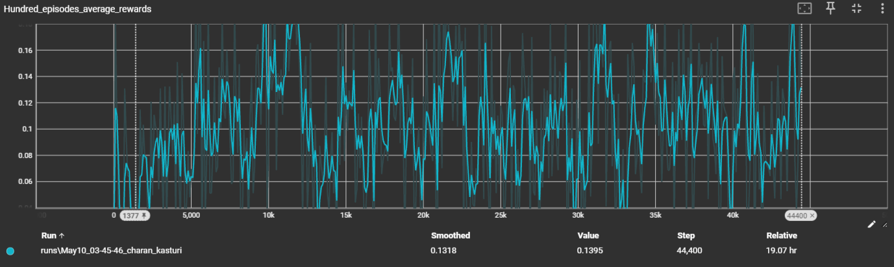

# Project: Kuka Robot RL - Object Grasping using DQN and PPO

## Author
Datta Lohith Gannavarapu (ENPM808Z - HW3 Bonus)

## Project Overview:
This project demonstrates training a Kuka robot using reinforcement learning (DQN and PPO) to grasp green objects from randomly placed objects in a simulated environment using PyBullet.

## Folder Contents:
- **kuka_rl.ipynb**: Training the Kuka robot using DQN.
- **kuka_rl_predict.ipynb**: Visualization of the trained DQN model.
- **policy_dqn.pt**: Saved DQN model policy.
- **kuka_rl_2.ipynb**: Training the Kuka robot using PPO.
- **kuka_rl_predict_1.ipynb**: Visualization of the trained PPO model.
- **policy_ppo.pt**: Saved PPO model policy.
- **demo_video.gif**: Demonstration of the Kuka robot attempting to grasp green objects after training.
- **epsilon.jpg**: Graph showing the epsilon values during training.
- **rewards.jpg**: Graph showing the rewards achieved during training.

## Prerequisites:
- Open the project in your preferred editor (Recommended: VSCode).
- Ensure all files are in the workspace.
- Install the following required libraries:
    ```bash
    pip install pybullet
    pip install tensorboardX
    pip install gym
    ```

## Steps to Run:
1. **Training the Model**:
    - Open [`kuka_rl.ipynb`](kuka_rl.ipynb) for DQN and [`kuka_rl_2.ipynb`](kuka_rl_2.ipynb) for PPO.
    - Run all cells.
    - If there is an error related to `registry.env_specs`, open the file mentioned in the error and remove `env_specs` from the line.
    
2. **Model Adjustments**:
    - When Running any file `kuka_rl.ipynb` or `kuka_rl_2.ipynb` for the first time, navigate to cell 3 and right-click on the `KukaDiverseObjectEnv` class, then select `"Go to Definition (F12)".`
    - Locate the reward function around line 277 and replace it with the following (preserve indentation):
    ```python
    def _reward(self):
        """ Calculates the reward for the episode. """
        def is_green(color):
            return color[1] > color[0] and color[1] > color[2]

        penalty = -0.15
        reward = 0
        self._graspSuccess = 0

        for uid in self._objectUids:
            pos, _ = p.getBasePositionAndOrientation(uid)
            _,_,_,_,_,_,_,color = p.getVisualShapeData(uid)[0]
            
            if pos[2] > 0.2:
                reward = 2 * penalty
            
            if pos[2] > 0.2 and is_green(color):
                print('Block is green and above height')
                self._graspSuccess += 1
                reward = 1
                break
        
        if reward == 0:
            reward = penalty
        
        return reward
    ```

    - Modify the object placement function to ensure at least 3 green objects:
    ```python
    def _randomly_place_objects(self, urdfList):
        """ Randomly places the objects in the bin. """
        objectUids = []
        green_count = 0
        
        for urdf_name in urdfList:
            xpos = 0.4 + self._blockRandom * random.random()
            ypos = self._blockRandom * (random.random() - .5)
            angle = np.pi / 2 + self._blockRandom * np.pi * random.random()
            orn = p.getQuaternionFromEuler([0, 0, angle])
            urdf_path = os.path.join(self._urdfRoot, urdf_name)
            uid = p.loadURDF(urdf_path, [xpos, ypos, .15], [orn[0], orn[1], orn[2], orn[3]])
            objectUids.append(uid)
            
            if green_count < 3:
                p.changeVisualShape(uid, -1, rgbaColor=[0, 1, 0, 1])
                green_count += 1
            
            for _ in range(500):
                p.stepSimulation()
        
        return objectUids
    ```

3. **Visualization**:
    - After training, the models are saved as `policy_dqn.pt` and `policy_ppo.pt`.
    - To visualize the performance:
        - Run `kuka_rl_predict.ipynb` for DQN.
        - Run `kuka_rl_predict_1.ipynb` for PPO.
    - You can use the pre-trained models directly for testing if needed.

## Results:
- **demo_video.gif**: Shows the Kuka robot picking up green objects after training.


- **epsilon.png**: Shows the epsilon decay over time during training.

- **rewards.png**: Shows the reward progression over episodes.

- The last cell in `kuka_rl_predict.ipynb` and `kuka_rl_predict_1.ipynb` displays the rewards vs episodes plot for that particular run.
